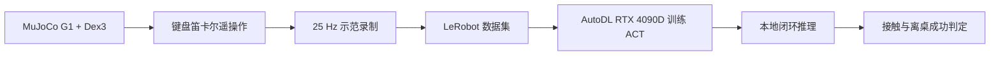

# Unitree G1 + Dex3 白杯抓取：MuJoCo + LeRobot ACT

[MIT License](LICENSE) · [Third-party notices](THIRD_PARTY_NOTICES.md)

本项目在 MuJoCo 中搭建 Unitree G1 右臂、Dex3 灵巧手、桌面白杯和头部相机，完成从键盘遥操作、示范采集、LeRobot 数据转换、ACT 训练到闭环策略评估的完整流程。

当前定位是一个**可复现的仿真模仿学习工程基线**。它已经证明策略能在多个固定杯子位置完成三指包络抓取和抬升；重复试验与扰动鲁棒性评估仍在进行，因此不把单次 `10/10` 描述为统计意义上的100%成功率。

## 系统流程



## 已完成功能

- G1右臂7自由度位置与姿态IK；
- Dex3七个手指关节控制和基于接触的自适应抓握；
- 头部RGB相机，图像尺寸为 `480×848×3`；
- `observation.state`：14D，7个右臂关节角 + 7个右手关节角；
- `action`：14D，7个右臂目标角 + 7个右手目标角；
- 25 Hz同步记录状态、动作、杯子位姿和头部相机视频；
- NPZ示范回放、第三人称/头部相机同步检查；
- LeRobot数据集转换；
- ACT离线推理和MuJoCo闭环执行；
- 手指接触力、关节跟踪误差、杯子离桌高度和桌面接触诊断；
- 固定位置评估、重复试验汇总和项目展示视频生成。

## 数据与模型

| 项目 | 当前配置 |
|---|---:|
| Demonstrations | 30条 |
| 总帧数 | 12,956 |
| 采样频率 | 25 Hz |
| 状态/动作 | 14D / 14D |
| 图像 | 头部RGB，480×848 |
| 任务文本 | `Pick up the white cup` |
| 策略 | LeRobot ACT |
| 训练设备 | NVIDIA RTX 4090D |
| 训练/验证 | 27条 / 3条 |
| 当前checkpoint | 30,000 steps |

选择30,000步checkpoint的依据是验证损失在30k附近达到最低点：20k为0.1432、30k为0.1431，继续训练到40k/50k后上升到0.1489。checkpoint选择最终仍应由闭环任务成功率验证。

## 环境

项目主要在本地 `lerobot` Conda环境运行：

```bash
conda activate lerobot
cd ~/projects/g1_mujoco
```

MuJoCo无头渲染使用：

```bash
export MUJOCO_GL=egl
```

主要依赖包括 Python 3.12、MuJoCo 3.8.1、LeRobot、PyTorch、NumPy、PyAV和OpenCV。

经过验证的精确版本、LeRobot提交和Unitree资源提交记录在 [ENVIRONMENT.md](ENVIRONMENT.md)。直接运行依赖记录在 [requirements.txt](requirements.txt)。PyTorch需要按照目标机器的CPU/CUDA版本单独安装。

## 遥操作与示范采集

启动交互场景：

```bash
MUJOCO_GL=egl python ~/projects/g1_mujoco/g1_cup_minimal.py
```

按键：

| 按键 | 操作 |
|---|---|
| `↑ / ↓` | TCP世界坐标 `+X / -X`，每次5 mm |
| `← / →` | TCP世界坐标 `+Y / -Y`，每次5 mm |
| `8 / 7` | TCP世界坐标 `+Z / -Z`，每次5 mm |
| `6 / 5` | yaw `+5° / -5°` |
| `4 / 3` | roll `+5° / -5°` |
| `2 / 1` | pitch `+2° / -2°` |
| `G` | 自适应三指抓握 |
| `H` | 1.5秒张开手指 |
| `R` | reset、随机杯子位置并开始录制 |
| `E` | 保存当前episode |
| `X` | 丢弃当前episode |
| `9` | 重置机器人和杯子 |

每个键盘运动进入0.4秒平滑FIFO动作队列；录制保存到 `demonstrations_npz/`。

回放一条示范：

```bash
MUJOCO_GL=egl python g1_cup_minimal.py \
  --replay-episode demonstrations_npz/episode_XXXXXXXX_XXXXXX_XXX.npz
```

生成第三人称与头部相机同步检查视频：

```bash
MUJOCO_GL=egl python g1_cup_minimal.py \
  --review-episode demonstrations_npz/episode_XXXXXXXX_XXXXXX_XXX.npz
```

## 转换为LeRobot数据集

```bash
python convert_npz_to_lerobot.py --overwrite
```

输出目录为 `lerobot_dataset/g1_white_cup/`。转换器会检查14D状态/动作、逐帧杯子位姿、时间戳、头部视频和有限数值。

## ACT闭环推理

当前统一评估协议：

- checkpoint：30,000 steps；
- ACT一次预测100个未来动作；
- 每次执行前25步后重新推理；
- 最长运行30秒，成功后提前停止；
- 成功标准：杯子最低碰撞点离桌至少10 mm、无杯子/桌面接触，并连续保持至少1.0秒。

运行一个指定位置：

```bash
MUJOCO_GL=egl python g1_cup_minimal.py \
  --act-policy models/g1_white_cup_14d_act_030000/pretrained_model \
  --act-execution-steps 25 \
  --act-rollout-seconds 30 \
  --act-cup-x 0.400 \
  --act-cup-y -0.050 \
  --act-video-out act_position_400_-050_30s.mp4
```

## 当前固定位置结果

十个预设位置都至少成功一次：

| X范围 | Y范围 | 单次覆盖结果 | 成功时间范围 |
|---|---|---:|---:|
| 0.340～0.400 m | -0.075～-0.025 m | 10/10 | 10.64～26.76 s |

完整表格见 [project_results/fixed_position_single_trial.md](project_results/fixed_position_single_trial.md)。这些结果是功能覆盖测试，每个位置只有一次试验。

此外，在最困难的标称位置 `(0.400, -0.050) m` 附近进行了10次X/Y各 `±2 mm` 的随机位置扰动测试：

| 指标 | 结果 |
|---|---:|
| 成功次数 | **10/10** |
| 平均成功时间 | 25.316 s |
| 成功时间标准差 | 1.501 s |
| 成功时间范围 | 22.88～27.44 s |
| 平均最终抬升 | 18.498 mm |

完整扰动报告见 [project_results/position_08_jitter_2mm.md](project_results/position_08_jitter_2mm.md)。这证明策略在一个困难位置附近具有局部鲁棒性，不代表整个工作空间具有100%成功率。

一个关键调试结论是：执行窗口为5步时，ACT不断重新预测接近阶段，手指闭合动作总被留在预测序列的未来；改为执行25步后，闭合动作能够进入实际控制并完成抬杯。对照数据见 `act_window_comparison.json`，对照视频见 `act_window_comparison.mp4`。

## 重复试验

最慢的位置（位置索引8，对应 `0.400, -0.050`）已经在完全相同的初始条件下重复5次：5/5成功，每次均在27.52秒满足成功判据，完成时间标准差为0。这证明流程可确定性复现，也说明继续重复完全相同的初始条件不会提供新的鲁棒性证据。

下一步在该标称位置附近独立采样X/Y各 `±2 mm`，进行10次局部扰动测试：

先只预览将使用的坐标，不启动MuJoCo：

```bash
python evaluate_act_repeated_positions.py \
  --position-index 8 \
  --repeats 10 \
  --cup-jitter-mm 2 \
  --seed 20260922 \
  --preview
```

确认坐标后再执行：

```bash
MUJOCO_GL=egl python evaluate_act_repeated_positions.py \
  --position-index 8 \
  --repeats 10 \
  --cup-jitter-mm 2 \
  --seed 20260922
```

实际位置按下面的公式生成：

```text
actual_x = nominal_x + uniform(-2, +2) mm
actual_y = nominal_y + uniform(-2, +2) mm
```

扰动实验默认写入独立目录 `act_position_jitter_eval/`，不会覆盖无扰动的 `act_repeated_position_eval/`。固定 `--seed` 可以重新生成完全相同的10组坐标。每次试验会记录标称坐标、实际坐标和X/Y偏移量。

这组实验已经完成并取得10/10成功。若继续开展研究，可以扩展到全部10个位置：

```bash
MUJOCO_GL=egl python evaluate_act_repeated_positions.py \
  --repeats 5 \
  --cup-jitter-mm 2 \
  --seed 20260922
```

默认不编码录像，以减少运行时间，但始终保留诊断CSV。加入 `--save-videos` 可保存所有MP4。程序支持断点续跑，输出：

- `act_repeated_position_eval/trials.csv`：每次试验；
- `act_repeated_position_eval/summary_by_position.csv`：每个位置成功率与完成时间统计；
- `act_repeated_position_eval/summary.json`：协议与总体结果。

当前扰动只改变杯子X/Y位置。初始关节、杯子质量、摩擦和相机参数保持不变，以便发生失败时能够明确归因于位置变化。

## 展示视频

现有项目视频为 [g1_white_cup_act_demo.mp4](g1_white_cup_act_demo.mp4)，分辨率1280×720，约46秒。重新生成：

```bash
python build_project_demo_video.py
```

脚本只剪辑已有录像，不重新运行MuJoCo。它包括执行窗口对照、三个位置的闭环抓取和严格成功判据。

## 主要文件

| 文件 | 用途 |
|---|---|
| `g1_cup_minimal.py` | 场景、IK、遥操作、录制、回放和ACT闭环推理 |
| `convert_npz_to_lerobot.py` | NPZ/MP4转LeRobot数据集 |
| `act_inference_smoke_test.py` | 本地checkpoint加载与单帧推理检查 |
| `act_compare_demonstrations.py` | ACT预测动作块与示范阶段对比 |
| `evaluate_act_fixed_positions.py` | 固定位置单次基准 |
| `evaluate_act_repeated_positions.py` | 重复试验、断点续跑与自动汇总 |
| `summarize_single_trial_results.py` | 合并已有十位置单次结果 |
| `build_project_demo_video.py` | 生成简历项目展示视频 |

## 已知限制

- 只有30条成功示范，场景、杯子和相机配置单一；
- 固定位置10/10是单次覆盖结果；最困难位置已完成5/5确定性复现和10/10的 `±2 mm` 局部位置扰动测试，但尚未覆盖整个工作空间的重复扰动；
- 尚未系统比较多个checkpoint和随机种子；
- 尚未通过遮挡/黑图实验验证视觉输入贡献；
- 当前结果只适用于MuJoCo仿真，未进行sim-to-real部署；
- 主脚本功能较集中，后续可按环境、控制、数据、策略和评估继续拆分。


